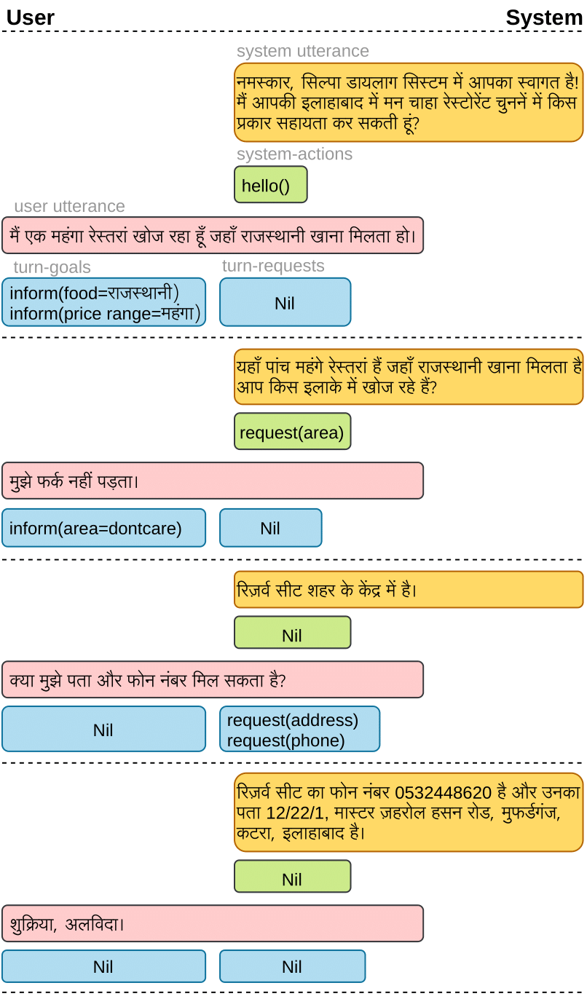
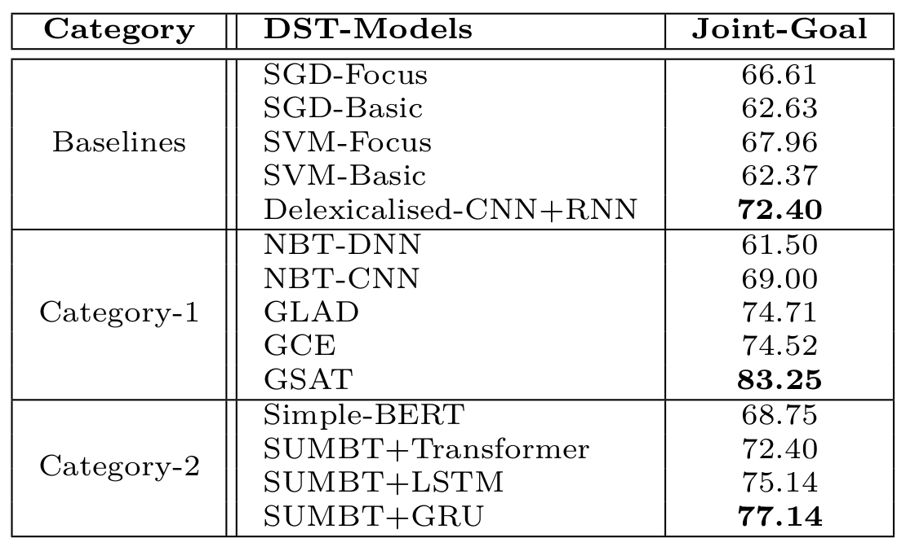

# HDRS-Corpus
Contact: Shrikant Malviya (s.kant.malviya@gmail.com), Rohit Mishra (rohit129iiita@gmail.com)

"HDRS- Hindi Dialogue Restaurant Search", is a fully-labelled collection of human-human written conversations in an Indic language Hindi on the restaurant domain. This is the first attempt to provide a dialogue corpus on the Hindi language.
* This corpus is collected to promote research and development in the field of the Hindi dialogue system.
* Corpus consists of 1400 dialogues collected using the Wizard-of-Oz paradigm, divided into Training (800), Development (200) and Testing (400) parts.
* The corpus uses the details of 118 Indian restaurants in a city named [Allahabad](https://en.wikipedia.org/wiki/Allahabad).

For more details, follow [HDRS: Hindi Dialogue Restaurant Search Corpus for Dialogue State Tracking in Task-Oriented Environment](https://ieeexplore.ieee.org/abstract/document/9376978) (Special issue DSTC-8, IEEE/ACM Transactions on Audio, Speech, and Language Processing)

## A sample dialogue form the corpus :


## Comparison of the DST models on Joint-Goal accuracy :
  * Category-1 =  **Static domain ontology** based DST,
  * Category-2 = **BERT-Based** DST




## References
If you use the HDRS dataset in your work, please cite the below paper:
```
[Malviya et al. 2021]
@article{malviya2021hdrs,
  author={Malviya, Shrikant and Mishra, Rohit and Barnwal, Santosh Kumar and Tiwary, Uma Shankar},
  journal={IEEE/ACM Transactions on Audio, Speech, and Language Processing},
  title={HDRS: Hindi Dialogue Restaurant Search Corpus for Dialogue State Tracking in Task-Oriented Environment},
  year={2021}
}
```
